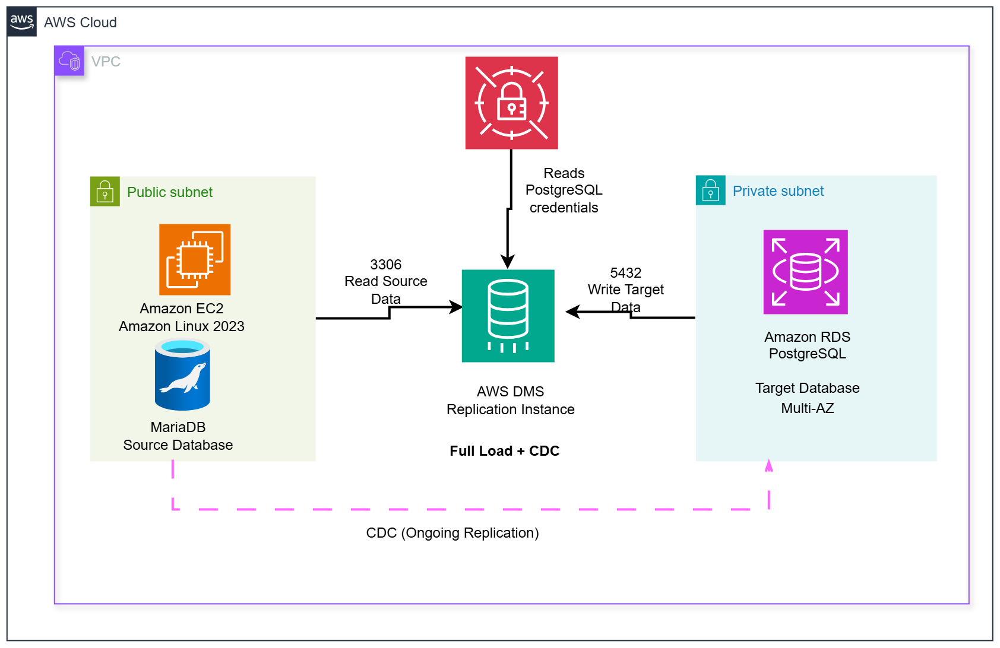
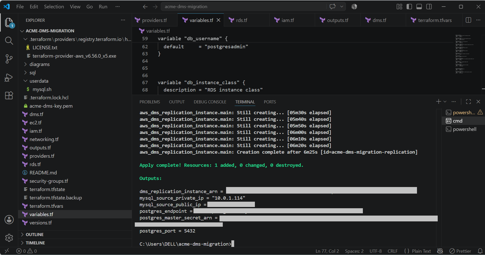
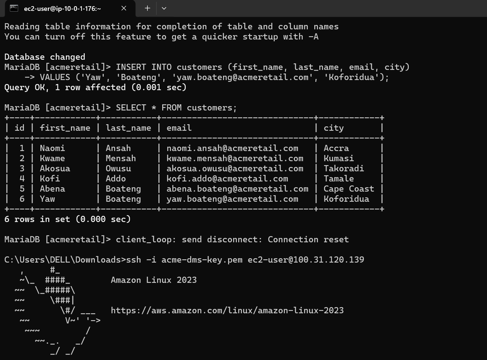
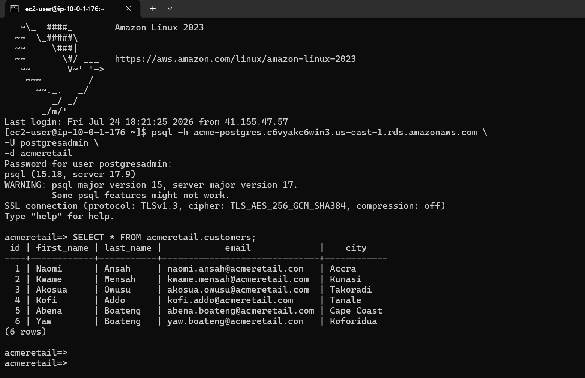

# MariaDB to PostgreSQL Migration Using AWS DMS & Terraform


An end-to-end heterogeneous database migration project demonstrating how to migrate a self-managed **MariaDB** database running on **Amazon EC2** to **Amazon RDS for PostgreSQL** using **AWS Database Migration Service (AWS DMS)**.

The infrastructure is provisioned entirely with **Terraform**, while AWS DMS performs an initial **Full Load** followed by **Change Data Capture (CDC)** for continuous replication.

# Architecture



# Project Overview

Many organizations still operate workloads on self-managed databases. Migrating these databases to managed services improves scalability, availability, security, and operational efficiency.

This project simulates a real-world migration by moving a MariaDB database hosted on Amazon EC2 to Amazon RDS for PostgreSQL with minimal downtime using AWS DMS.

# AWS Services Used

| Service               | Purpose                                |
| --------------------- | -------------------------------------- |
| Amazon EC2            | Hosts the source MariaDB database      |
| Amazon RDS PostgreSQL | Managed target database                |
| AWS DMS               | Performs Full Load and CDC replication |
| AWS Secrets Manager   | Securely stores database credentials   |
| AWS IAM               | Grants DMS required permissions        |
| Amazon VPC            | Network isolation                      |
| Security Groups       | Controls database access               |
| Terraform             | Infrastructure as Code                 |

# Migration Workflow

1. MariaDB running on Amazon EC2 acts as the source database.
2. AWS DMS connects to MariaDB through port **3306**.
3. AWS DMS retrieves PostgreSQL credentials from AWS Secrets Manager.
4. DMS performs an initial **Full Load**.
5. Data is written to Amazon RDS PostgreSQL through port **5432**.
6. **Change Data Capture (CDC)** continuously synchronizes new database changes.

# Repository Structure

```text
acme-dms-migration/
│
├── architecture/
│   └── Acme-Retail-DMS-Architecture.png
│
├── screenshots/
│   ├── terraform-apply.png
│   ├── DMS-endpoints.png
│   ├── mariadb-data.png
│   └── postgres-verification.png
│
├── sql/
│   ├── schema.sql
│   └── seed.sql
│
├── userdata/
│   └── mysql.sh
│
├── providers.tf
├── networking.tf
├── ec2.tf
├── rds.tf
├── dms.tf
├── iam.tf
├── security-groups.tf
├── variables.tf
├── versions.tf
├── outputs.tf
├── README.md
└── .gitignore
```

# Deployment

Clone the repository.

```bash
git clone https://github.com/Naomiansah/acme-dms-migration.git

cd acme-dms-migration
```

Initialize Terraform.

```bash
terraform init
```

Validate the configuration.

```bash
terraform validate
```

Review the execution plan.

```bash
terraform plan
```

Deploy the infrastructure.

```bash
terraform apply
```

---

# Validation

The migration was verified by:

- Successful source endpoint validation
- Successful target endpoint validation
- Full Load completion
- Continuous CDC replication
- Matching records in MariaDB and PostgreSQL

---

# Project Screenshots

## Terraform Deployment



---

## AWS DMS Endpoints


---

## Source Database (MariaDB)



---

## Target Database (PostgreSQL)



---

# Challenges Encountered

### AWS DMS Endpoint Authentication

After recreating the EC2 instance, the MariaDB migration user no longer existed, causing the source endpoint test to fail.

**Resolution**

Recreated the migration user and granted the required database permissions.

---

### AWS Secrets Manager Integration

The automatically generated RDS secret lacked the connection properties required by AWS DMS.

**Resolution**

Created a dedicated secret containing:

- host
- port
- engine
- dbname
- username
- password

---

### Security Group Troubleshooting

AWS DMS successfully connected to PostgreSQL, but direct verification from EC2 initially failed.

**Resolution**

Added a temporary PostgreSQL security-group rule for validation and removed it afterward.

---

### Terraform Dependencies

The DMS replication instance depended on IAM resources that needed to exist first.

**Resolution**

Explicit Terraform dependencies ensured the correct resource creation order.

---

# Lessons Learned

This project strengthened my understanding of:

- Terraform Infrastructure as Code
- AWS Database Migration Service
- Change Data Capture (CDC)
- AWS Secrets Manager
- IAM Roles and Least Privilege
- Amazon RDS
- Security Groups
- Production-style cloud troubleshooting

---

# Cleanup

Destroy the infrastructure after testing.

```bash
terraform destroy
```

---

# Author

**Naomi Ansah**

AWS Certified Cloud Practitioner

Aspiring Cloud Solutions Architect

- **LinkedIn:** https://www.linkedin.com/in/naomi-ansah/
- **DEV.to:** https://dev.to/naomi_ansah_cloud
